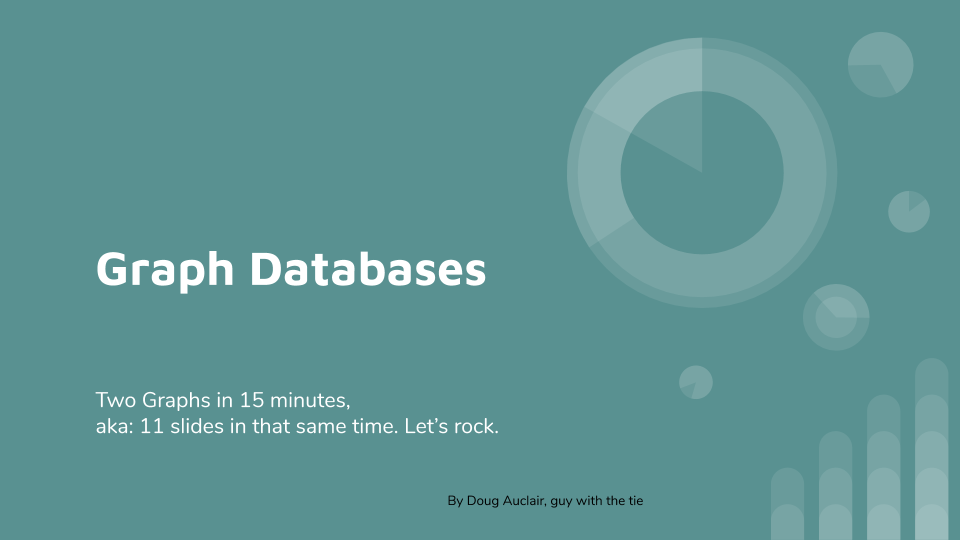
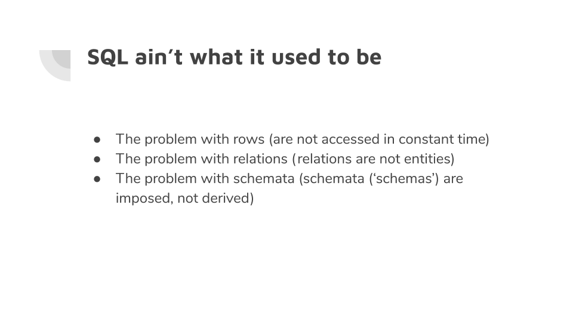
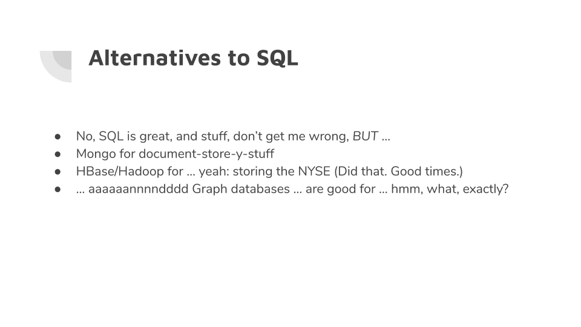
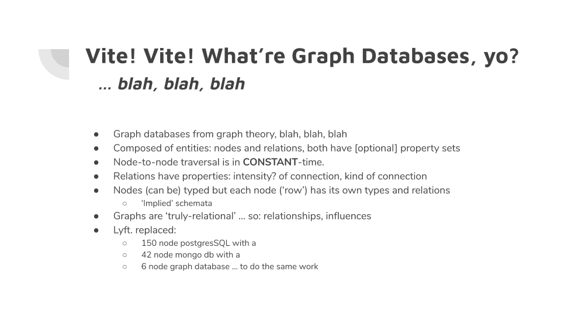
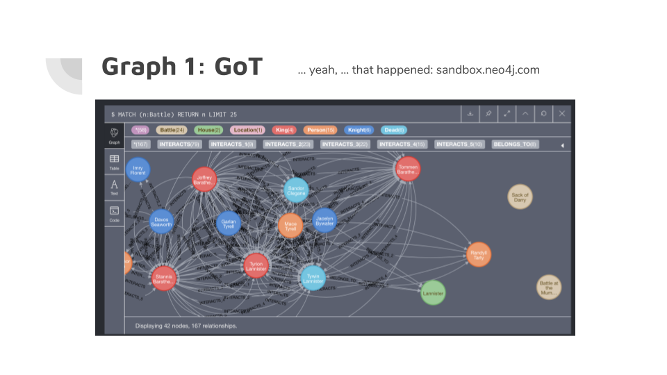
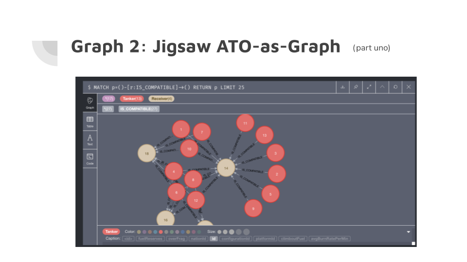
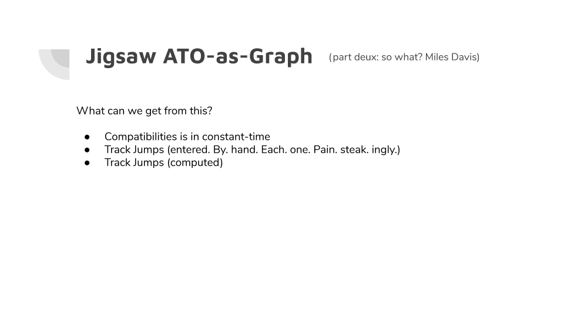
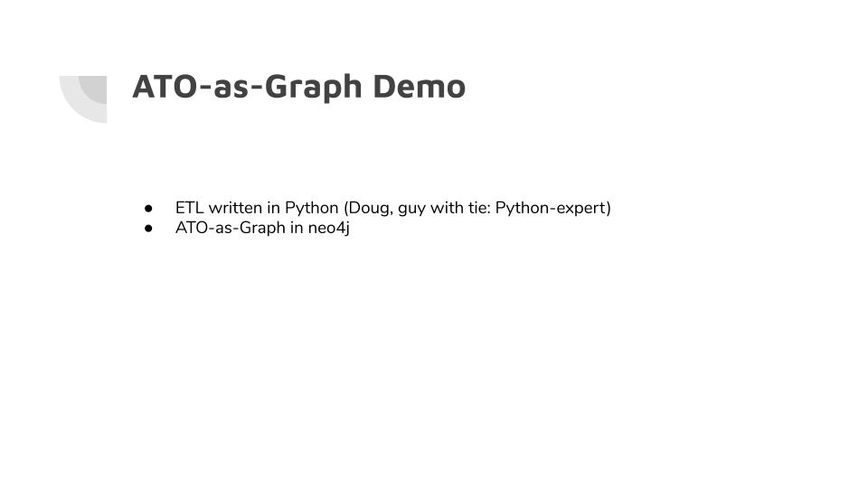
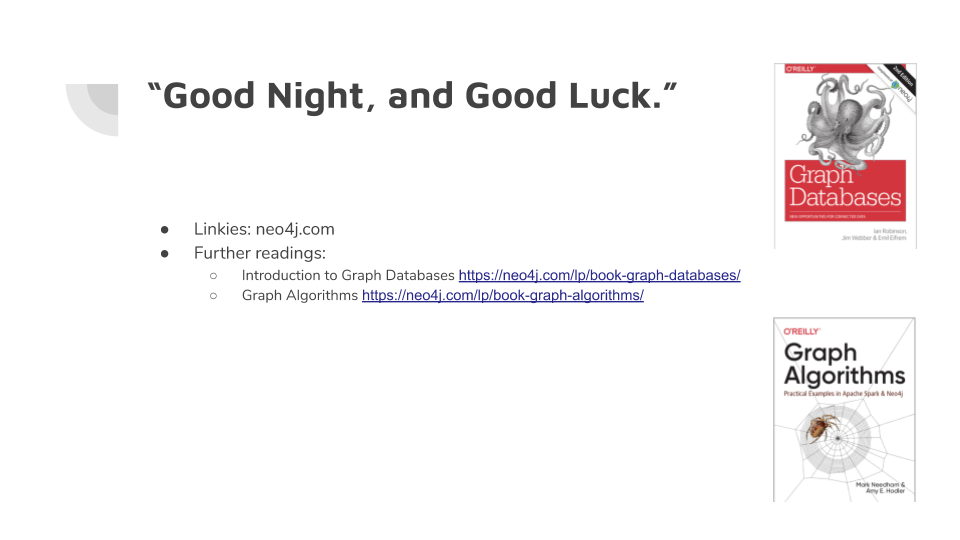

# Graph lightning talk

## Title

Graph Databases
Two Graphs in 15 minutes, 
aka: 11 slides in that same time. Let’s rock.
by Doug Auclair, guy with the tie

## SQL ain’t what it used to be

* The problem with rows (are not accessed in constant time)
* The problem with relations (relations are not entities)
* The problem with schemata (schemata (‘schemas’) are imposed, not derived)

## Alternatives to SQL

* No, SQL is great, and stuff, don’t get me wrong, BUT …
* Mongo for document-store-y-stuff
* HBase/Hadoop for … yeah: storing the NYSE (Did that. Good times.)
* … aaaaaannnndddd Graph databases … are good for … hmm, what, exactly?

## Vite! Vite! What’re Graph Databases, yo?

* Graph databases from graph theory, blah, blah, blah
* Composed of entities: nodes and relations, both have [optional] property sets
* Node-to-node traversal is in CONSTANT-time.
* Relations have properties: intensity? of connection, kind of connection
* Nodes (can be) typed but each node (‘row’) has its own types and relations
* ‘Implied’ schemata
* Graphs are ‘truly-relational’ … so: relationships, influences

### ex: Lyft

Lyft. replaced: 

* 150 node postgresSQL with a
* 42 node mongo db with a
* 6 node graph database … to do the same work

## FOX BREAK!

## Graph 1: Game of Thrones

## Graph 2: ATO-as-Graph

## ATO-as-Graph

What can we get from this?

* Compatibilities is in constant-time
* Track Jumps (entered. By. hand. Each. one. Pain. steak. ingly.)
* Track Jumps (computed)

## ATO-as-graph Demo

* ETL written in Python (Doug, guy with tie: Python-expert)
* ATO-as-Graph in neo4j

## “Good Night, and Good Luck.”

### Linkies: neo4j.com

### Further readings:
1. [Introduction to Graph Databases](https://neo4j.com/lp/book-graph-databases/)
2. [Graph Algorithms](https://neo4j.com/lp/book-graph-algorithms/)

## PEACE OUT!

Juniper sez: “PEACE OUT!”
… and THAT’S what the fox says!

